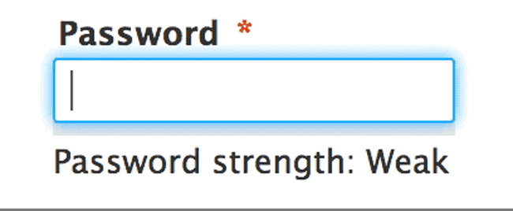

# PasswordSafetyChecker

      

---

## 🚀Yo, Welcome to PasswordSafetyChecker!

Think your password is Fort Knox? Think again, fam! 😎
Sick of those fake “strong” password meters giving you a thumbs up when your password’s actually a dumpster fire? 🔥💀  
This bad boy goes *deep* — like hacker’s dark web level deep — to check if your password’s been leaked, stolen, or thrown around like last year’s memes.  

Say buh-bye to fake flexin’ and hello to *real* security! 🔒✨
---

💡 Why You Actually Need This

- ✅ “Strong” ≠ “Safe” (yeah, shocking, right?)  
- ✅ Finds out if your password’s been caught red-handed in a data breach 😱  
- ✅ Gives you live tea on your password’s strength and breach status ☕  
- ✅ Privacy vibes only — hashes your password so no one’s nosing around your secrets 🤫  
- ✅ Works *everywhere* — no more sketchy security holes on random sites 🚀

---

🛠 What This Baby Does  

- **Breach Detector 3000:** Powered by Have I Been Pwned API, but with privacy ninja SHA-1 hashing & k-anonymity. Your secrets stay secret. 🥷  
- **Real AF Strength Meter:** Scores your password like a savage — length, caps, numbers & symbols included.  
- **Dynamic Everywhere:** Checks password fields on any site, like a stealthy cyber ninja.  
- **Clean AF UI:** Popup that’s so simple even your grandma could use it (no offense, grandma).  
- **Background Wizardry:** Chrome Manifest V3 magic for smooth, lightning-fast vibes ⚡️

---

🎉 How to Install and Flex  

1. Download or clone this repo (don’t worry, no shady links).  
2. Pop open Chrome and type `chrome://extensions/` like a boss.  
3. Flip the *Developer Mode* switch (top right).  
4. Hit **Load unpacked**, select the folder, and boom! Your browser just leveled up. 🔥
---

🧑‍💻 How to Use This Magic  

- Click the extension icon like it owes you money.  
- Type in your sketchy password.  
- Watch the meter roast your password or give props if it’s solid.  
- Change your password if it’s been pwned or else hackers gonna have a party on your account 🎉💀 

---

⚙️ Tech Stack (Geek Stuff)  

- Frontend: HTML, CSS, JavaScript (the classics)  
- API: Have I Been Pwned (because we’re classy hackers)  
- Security: SHA-1 + k-anonymity = no peeping toms allowed 🔒  
- Chrome Extension: Manifest V3, background workers, content scripts — keeping it fresh and safe.  

---

🤝 Wanna Help or Roast?  

Found a bug? Got a crazy feature idea? Fork it, branch it, PR it! We love collabs and chaos. Bring your A-game and memes. 🤓🔥  

---

🎯 Commit Messages You’ll Actually Like  

- feat: Added breach detection — your passwords can’t hide no more! 🕵️‍♂️  
- fix: Squashed that bug making weak passwords look strong 🐞💥  
- docs: README got sassier, less boring 📝🔥  
- style: UI got a fresh paint job, looking sharper than your passwords 🎨✨  
- refactor: Cleaned the code — no password closets allowed messy! 🧹🚪  

---

❤️ Thanks for stopping by!

This is a labor of love, caffeine, and endless password nightmares.  
Star ⭐ the repo, share with your crew, and let’s make the internet a safer place — one password at a time! 🙌

---

📜 License  

MIT License © 2025 Dwip Sahajee — Sharing is caring, but password stealing is a big no-no 😤

---

*Now go flex those safe passwords like the legend you are!* 🚀😎  
